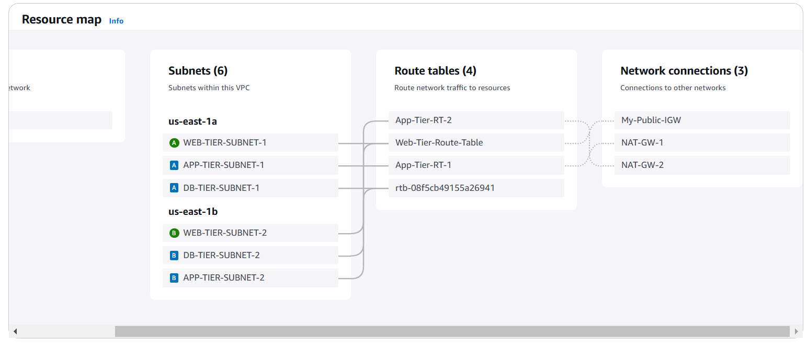

# **Deploying a 3-Tier Network VPC Architecture on AWS**

## **Project Overview**

This project demonstrates the deployment of a 3-Tier architecture on AWS, ensuring high availability, fault tolerance, and security for web applications. The project involves setting up a **Web Tier (ReactJS & Nginx), App Tier (NodeJS & MySQL), and Database Tier (MySQL RDS)** within a custom-built **Virtual Private Cloud (VPC)** with multiple availability zones.

The infrastructure is designed to be scalable, resilient, and secure, leveraging **AWS networking resources, load balancers, auto-scaling, and managed services**.

## **Key Features**
- **Custom VPC**: Includes private and public subnets across multiple availability zones for high availability.
- **Nginx & ReactJS for Web Tier** (Port 80)
- **NodeJS & MySQL for App Tier** (Port 4000)
- **MySQL RDS for Database Tier** (Port 3306)
- **Load Balancing & Auto Scaling**: Implements ALBs and ASGs for scalability and fault tolerance.
- **Security-Optimized Architecture**: Controlled access through security groups and IAM roles.
- **S3 Buckets for Storage**:
  - **S3-1**: Stores application code.
  - **S3-2**: Stores VPC flow logs.
- **AWS Services Used**: EC2, RDS, S3, Route 53, CloudWatch, CloudTrail, IAM, NAT Gateway, and Auto Scaling Groups.

## **Infrastructure Deployment Steps**

### **1. Setup AWS Storage & Permissions**
- Create an **S3 bucket** and upload application code.
- Create an **IAM Role** with the following policies:
  - S3 Read-Only Access
  - **SSM Managed Instance Core** (for seamless communication without SSH access).

### **2. Networking Configuration**
- Create a **VPC, Subnets, Internet Gateway, NAT Gateway, and Route Tables**.
- Enable **VPC Flow Logs** and store logs in an S3 bucket.
- Attach **Internet Gateway (IGW)** to allow external access.
- Create a **NAT Gateway** for secure outbound traffic from private subnets.
- Configure **Route Tables**:
  - Web-Tier route table (Attach IGW and connect to web-tier subnets).
  - App-Tier route table (Attach NAT Gateway for private communication).

### **3. Security Groups Setup**
- **EXT-LB-SG** → Allow HTTP (80) from the internet.
- **Web-Tier-SG** → Allow HTTP (80) from EXT-LB-SG.
- **INT-LB-SG** → Allow HTTP (80) from Web-Tier-SG.
- **App-Tier-SG** → Allow Port 4000 from INT-LB-SG.
- **DB-Tier-SG** → Allow MySQL (3306) from App-Tier-SG.

### **4. Database Deployment**
- Create an **RDS MySQL database** with Multi-AZ deployment for high availability.
- Use a **DB subnet group** (no bastion host required).

### **5. App Tier Deployment**
- Launch a **Test App Server**, install necessary packages (MySQL, NodeJS), and test connections.
- Create an **AMI** from the configured instance.
- Create a **Launch Template** using the AMI.
- Configure a **Target Group** and **Internal Load Balancer**.
- Create an **Auto Scaling Group** with:
  - Launch Template
  - Target Group
  - Load Balancer
  - Notification Subscription for scaling events.

### **6. Web Tier Deployment**
- Launch a **Test Web Server**, install required packages (Nginx, ReactJS), and test connections.
- Create an **AMI** from the configured instance.
- Create a **Launch Template** using the AMI.
- Set up a **Target Group** and **External Load Balancer**.
- Create an **Auto Scaling Group** for high availability.

### **7. DNS & Monitoring Configuration**
- Add **External-ALB-DNS Record** in **Route 53** for domain resolution.
- Configure **CloudWatch Alarms** for monitoring system metrics.
- Enable **CloudTrail** for tracking and security auditing.

## **Learning Outcomes**
This project provides hands-on experience in AWS networking, infrastructure design, database management, and cloud security. By implementing a **3-Tier architecture**, you will gain expertise in:
- Designing a **Highly Available** and **Fault-Tolerant** cloud environment.
- Configuring **Load Balancers & Auto Scaling** for seamless traffic distribution.
- Implementing **Secure Networking** through VPCs, Security Groups, and IAM Roles.
- Deploying and managing **RDS Databases** in a Multi-AZ setup.
- Utilizing **AWS Storage Solutions (S3)** for logs and application data.
- Implementing **CloudWatch & CloudTrail** for monitoring and logging.

This project strengthens fundamental **AWS networking principles**, making it an excellent practice for **n-tier architecture deployment in real-world cloud environments**.

